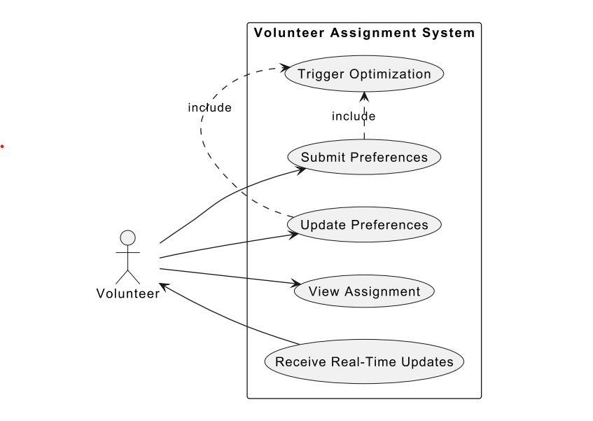
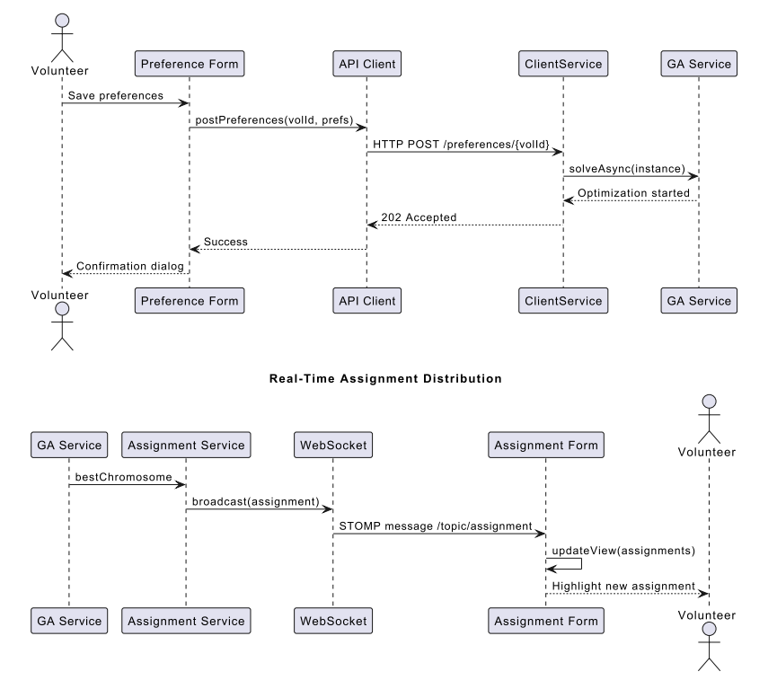
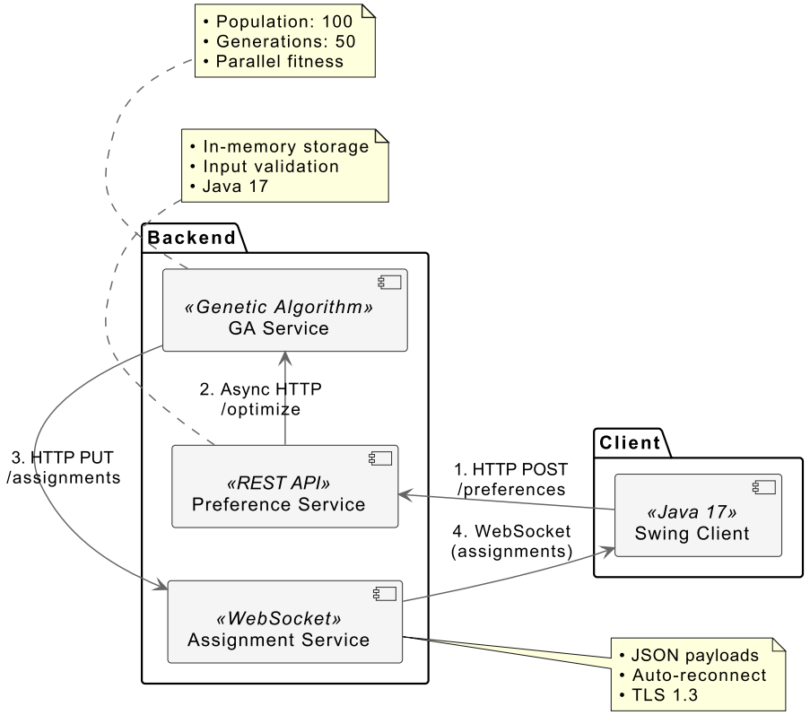
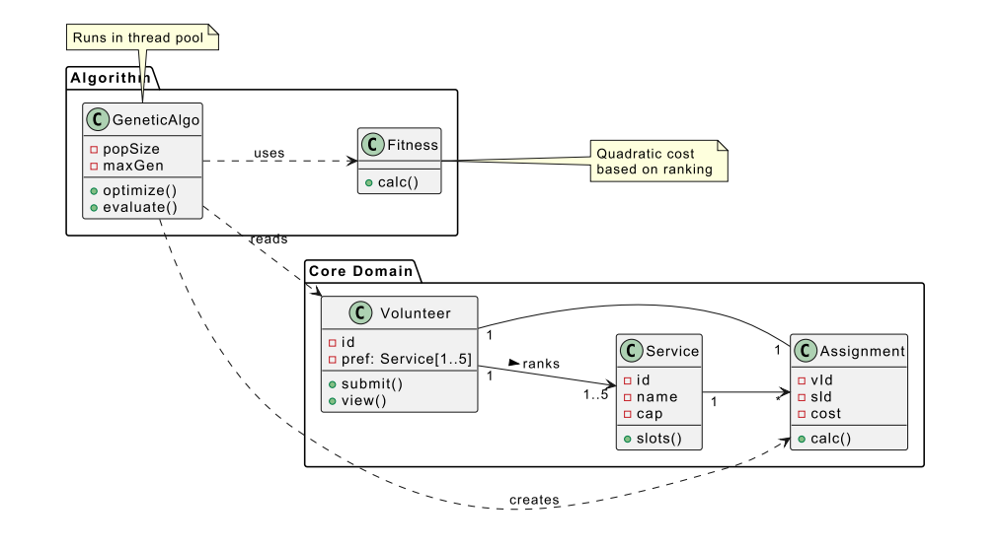
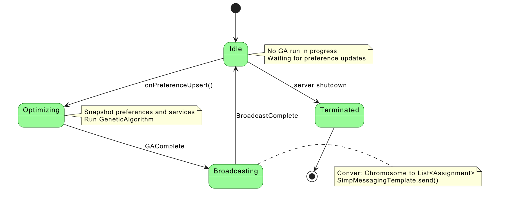
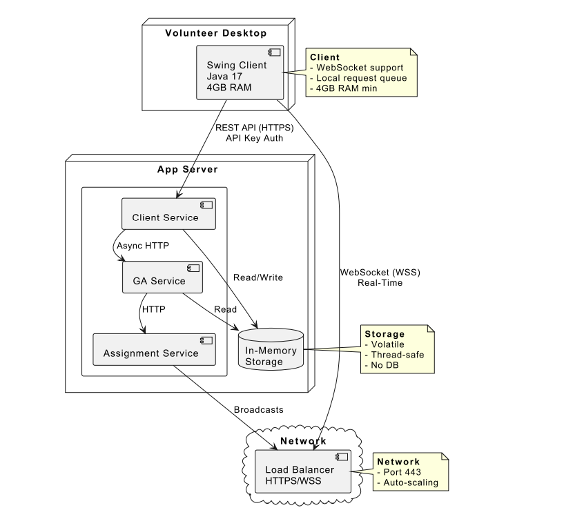

# Distributed Assignment System

This project aims to simplify and improve the process of assigning volunteers to
specific roles during large-scale events such as community festivals or conferences.
Balancing personal role preferences with staffing requirements is often challenging
and can result in inefficient placement and uneven workloads. The Volunteer Assignment System addresses this by automatically distributing volunteers to roles based
on their ranked preferences while keeping capacity constraints for each service.

The assignment process runs continuously in the background, adjusting in real
time as volunteers review their preferences. This dynamic matching ensures that
individuals are more likely to be placed in roles they value, while also maintaining
balanced coverage across event services. As a result, volunteers gain greater control
and clarity over their contributions.

## Main features
Volunteers interact with the system through a lightweight interface, where they can
specify and update their preferred roles at any time. Event services (e.g., Registration, Food Service) are defined with fixed capacity limits. When preferences change,
the system re-evaluates the distribution using a matching algorithm and updates
assignments immediately. This allows each volunteer to receive near-instant feedback on their current role assignment and ensures that service limits are respected
without manual intervention.

## Detailed Specifications 
* ### Functional Specifications
    The system shall allow volunteers to submit and update their ranked preferences for
    event services through a graphical interface. Volunteers must be able to select up
    to five preferred services in priority order, and the system validates the selections to
    prevent duplicates or invalid entries. When preferences are submitted, the system
    shall immediately trigger an optimization process to reassign all volunteers while
    respecting each service’s maximum capacity. The algorithm shall prioritize volunteers who ranked a service higher when capacity limits are reached, automatically
    redistributing others to their next available preference.

    Volunteers shall view their current assignment through a dashboard that displays
    service details. The interface shall include visual indicators when new assignments
    are available. System initialization requires predefined service capacities, which are
    loaded from configuration files at startup before accepting volunteer submissions.
* ### Interface Specifications
    Volunteers interact with a desktop client that features a form with a menu populated
    by service lists retrieved from the server during client initialization. The interface
    shall render the assignment in a separate tab.
    
    The backend implements a REST API that accepts JSON payloads with volunteer IDs and ranked service lists, responding with HTTP status codes (200 for
    success, 400 for invalid requests). Real-time updates are sent through WebSocket
    connections that carry JSON-formatted assignment objects containing service IDs
    and volunteer IDs. Clients are required to automatically retry failed requests during
    temporary network issues.

    
* ### Operational Specifications
    The system must process preference updates and recalculate assignments in 15 seconds for 30 volunteers and 10 services, maintaining linear scaling up to 200 volunteers. WebSocket broadcasts shall reach all connected clients within 2 seconds of optimization completion, with message delivery guaranteed through acknowledgment
    protocols. All data persists only in memory during operation, with no persistent
    storage requirements beyond the runtime session.

    Client-server communication shall enforce TLS encryption. The optimization
    algorithm runs in a dedicated thread pool to maintain server responsiveness during
    intensive computations, with load distributed across available CPU cores. The Java
    Virtual Machine requires minimum 2GB heap allocation for 100 volunteers, scaling proportionally with participant count. Clients automatically queue submissions
    during network outages, synchronizing when connectivity is restored.

## Hardware/Software Constraints
The system requires Java 17 or higher and a minimum of 4GB RAM to support realtime optimization. Volunteers must use devices with stable internet connectivity
for WebSocket-based updates. The client application runs on standard desktop
environments supporting Java Swing, while the backend operates on any machine
meeting the RAM and processor requirements (4-core CPU recommended for events
exceeding 100 participants).

## System design
The stateless design ensures scalability across event sizes while minimizing hardware dependencies. For example, the optimization engine processes each preference
change as an independent event, recalculating assignments from the latest snapshot of volunteer data. This approach eliminates persistent storage requirements
while guaranteeing consistency during peak usage periods. The design prioritizes
computational efficiency through parallel processing.

* ### Preliminary Design
    The system comprises three primary components: a Java Swing client for volunteer
    interactions, a backend microservice suite built with Spring Boot , and a WebSocketbased notification layer. The client application handles preference input validation
    and renders assignment updates through a responsive interface built with Swing’s
    event dispatch thread model.
    
    Backend services are decomposed into two specialized modules: the Assignment
    Service coordinates volunteer assignment optimization using genetic algorithms and
    the Client Service manages clients request using REST API.

    

* ### Module-Level Design
    The Preference Service implements a REST controller. It maintains thread-safe inmemory storage using concurrent collections, triggering optimization cycles through
    calls to the GA Service. Each call carries a snapshot of current preferences and
    service configurations to ensure calculation consistency.
    
    Within the GA Service, the algorithm module initializes candidate solutions using volunteer preference data, evaluates fitness based on ranking satisfaction and
    capacity compliance, and iteratively improves solutions through evolutionary operations.
    
    The WebSocket handler manages persistent connections using Spring’s WebSocket API, sending JSON-serialized assignment updates to connected clients. Message payloads prioritize readability over size optimization.

* ### Component Interactions
    When the client application initializes, it first sends an HTTP GET request to
    the server to fetch the current list of available services and their capacities. This
    data populates the menu before allowing preference submissions. When a volunteer updates preferences, the Swing client submits a JSON payload to the Server’s
    REST endpoint. After validation, the service asynchronously invokes the GA Service with current data snapshots. The optimization process runs for a fixed number
    of generations or until convergence criteria are met, whichever comes first, typically
    completing within 10 seconds for standard configurations.
    
    Resulting assignments are formatted into WebSocket messages and pushes to all
    connected clients. The client interface renders updates by comparing new assignments with previous states.

    

## Deployment Considerations

The system requires Java 17+ across all components, with The backend microservices implemented as Spring Boot applications packaged as executable JAR files
with embedded Tomcat servers. Clients deploy as platform-specific installers that
bundle a minimal JRE. Network configuration must allow WebSocket traffic on the
designated port (default 443 for WSS), with firewall rules permitting HTTP communication between microservices.

Memory allocation follows linear scaling: 2GB JVM heap for 100 volunteers,
increasing by 500MB per additional 50 participants. CPU requirements depend
on optimization complexity - a 4-core processor handles 200 volunteers comfortably,
while larger events benefit from 8+ cores. All components support horizontal scaling
behind load balancers, with stateless design enabling seamless instance additions
during runtime.

## Possible Improvements

Several enhancements could be implemented to improve the robustness, scalability,
and user experience of the system.

From a security perspective, integrating TLS via Let’s Encrypt certificates behind an Nginx proxy would provide encrypted communication, ensuring confidentiality. Additionally, incorporating JWT-based authentication would enable user
identification and secure access to volunteer-specific data.

To enhance scalability, the current single-threaded genetic algorithm executor
could be replaced with a bounded virtual-thread pool. By enabling parallel fitness
evaluation across multiple CPU cores, the system could efficiently handle optimization tasks for 500 or more volunteers without degradation in responsiveness.

In the user interface, implementing a color-coded satisfaction bar would provide immediate visual feedback on how well volunteer preferences were matched.
Introducing offline-first caching strategies could further support mobile clients and
enhance usability in areas with unstable internet connections.

Although persistence was initially avoided, introducing optional PostgreSQL
storage would allow the system to retain historical preference data and maintain
an audit log. This could support analytics features and provide a basis for restoring
prior system states.

Operational observability can be significantly improved by integrating Prometheusbased telemetry. Tracking metrics such as GA latency seconds and the number
of active WebSocket connections would enable administrators to monitor system
health. A Grafana dashboard could visualize these metrics in real time.

To broaden client compatibility, switching the WebSocket implementation to /ws
using SockJS with the STOMP protocol would simplify browser-side integration,
facilitating the development of alternative frontends beyond Java Swing.

Lastly, the core assignment algorithm could be enhanced by adopting a hybrid
approach, combining the genetic algorithm with hill-climbing or tabu search techniques. This would improve convergence rates and result quality, especially under
strict time constraints during high-load events.

# Thanks for your attention! 